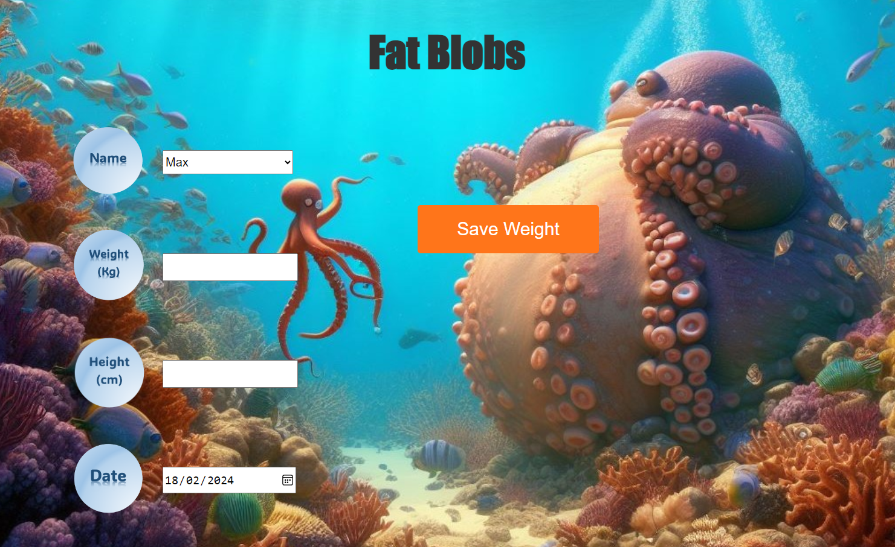

<h1 style="color: #ff8000;">Max Griffiths</h1>

Passionate software developer with a background in Biomedical Science and Public Health, currently pursuing a Certificate in Software Engineering. Skilled in Python, HTML, CSS, and data analysis. Experienced in leading teams and problem-solving.

<h2 style="color: #ff8000;">About Me</h2>

I am a dedicated software developer with a keen interest in leveraging technology to solve real-world problems. My journey started in the field of Biomedical Science and Public Health, where I gained valuable insights into scientific methodologies and processes. Building upon this foundation, I am now focused on honing my skills in software development, with a particular emphasis on Python and web development technologies.

<h2 style="color: #ff8000;">Skills</h2>
<ul>
  <li>Languages: Python, HTML, CSS</li>
  <li>Technologies: Git, GitHub, PowerShell, SPSS</li>
  <li>Soft Skills: Team leadership, problem-solving, time management</li>
</ul>

<h2 style="color: #ff8000;">Projects</h2>
<h3>Fat Blobs</h3>

A group weight loss tracking web application

Tools: Python, JavaScript, HTML, CSS

<a href="https://github.com/MaxDDDGGG/FATBLOBS">GitHub Repository</a>

<!-- Image gallery for project -->

    
    
    
    Dynamic Diagnostics Bacterial ID</h3>

Customizable bacterial identification software

Tools: Python

<a href="https://github.com/MaxDDDGGG/Dynamic-Diagnostics-ID">GitHub Repository</a>

<h2 style="color: #ff8000;">Education</h2>
<ul>
  <li>HyperionDev
    <ul>
      <li>Certificate in Software Engineering (DoE); Grade: 98%</li>
      <li><a href="https://github.com/MaxDDDGGG/HyperionDev-course-work">GitHub Repository</a></li>
    </ul>
  </li>
  <li>London Metropolitan University - Post Graduate Diploma in Biomedical Science; Grade: 2:1</li>
  <li>Leeds Metropolitan University - Bachelor of Science in Public Health Nutrition (Hons); Grade: 2:2</li>
</ul>

<h2 style="color: #ff8000;">Employment</h2>
<h3>Primary Scientist - Gold Standard Diagnostics, Budapest, Hungary</h3>

Managed team, optimized processes, and conducted software investigations

<h3>Production Scientist - Microgen Bioproducts, Camberley, UK</h3>

Led process development projects, improved vaccine yield

<h3>Associate Practitioner - Northwest London Pathology, London, UK</h3>

Conducted laboratory duties, ensured high-quality standards

<h3>Senior Medical Lab Assistant - Northwest London Pathology, London, UK</h3>

Managed sample reception, achieved efficiency targets

<h3>Medical Lab Assistant - Charing Cross Hospital, London, UK</h3>

Processed samples, maintained quality control standards

<h2 style="color: #ff8000;">Contact Me</h2>
<ul>
  <li>Email: M.Griffiths22@outlook.com</li>
  <li>LinkedIn: <a href="https://www.linkedin.com/in/max-griffiths-427081239/">Max Griffiths</a></li>
</ul>

